# 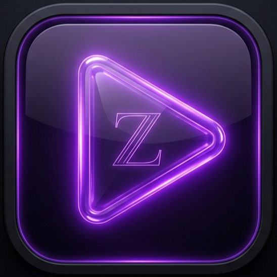 Streamzee `v1.0.0-beta1`

**Streamzee** is a clean, cinematic, and unified streaming hub for Android. It brings together Movies, TV Series, and Anime into a single, high-performance interface built entirely with Jetpack Compose.

> **⚠️ Beta Phase Notice:** This application is currently in its early beta. While core streaming functionality is stable, the **Downloads** and **Profile** tabs are currently under development and will be available in future updates.

---

## 📱 App Demo & UI Showcase

Streamzee is designed with an AMOLED-black aesthetic and purple neon accents to provide a premium viewing experience.

### 🏠 Home & Discovery
| Home Page | Personal Watchlist |
|:---:|:---:|
| 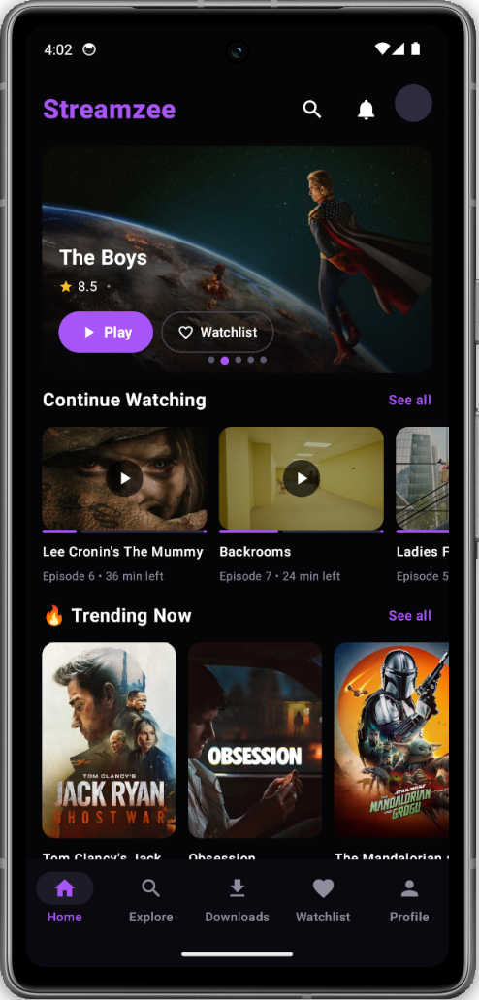 | 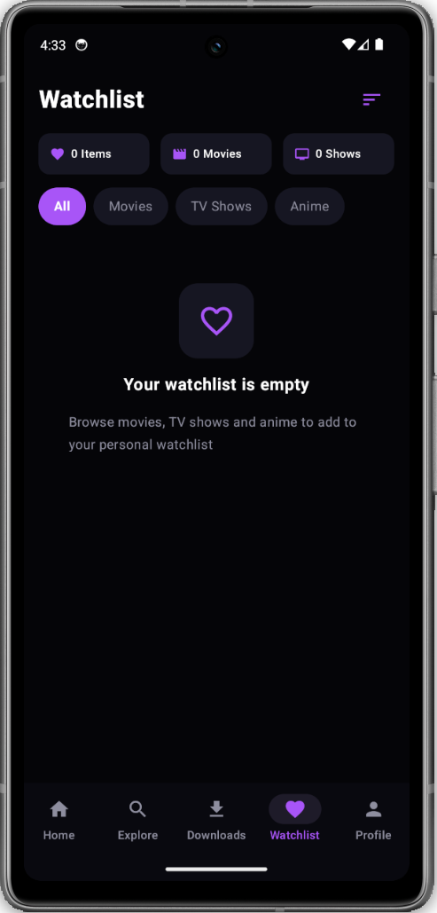 |

### 🔍 Universal Search (Categories)
| Movies | TV Shows | Anime |
|:---:|:---:|:---:|
| 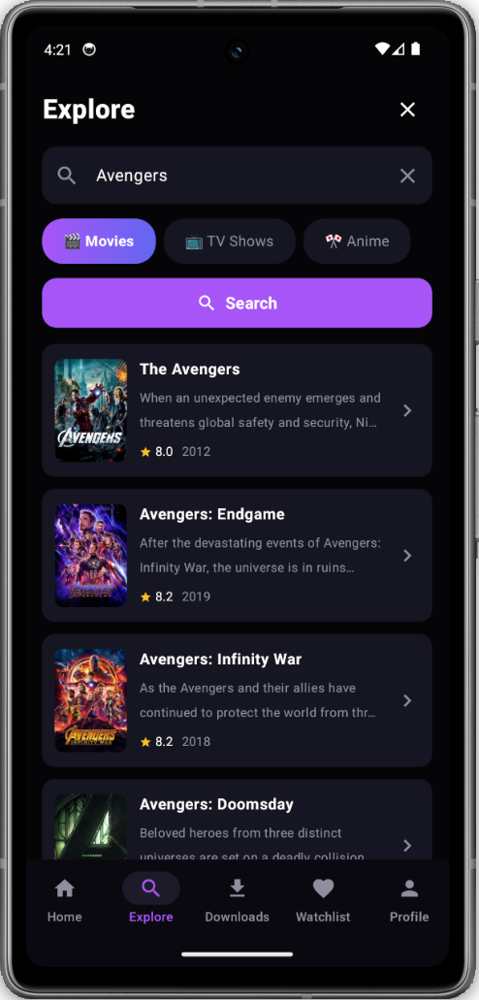 | 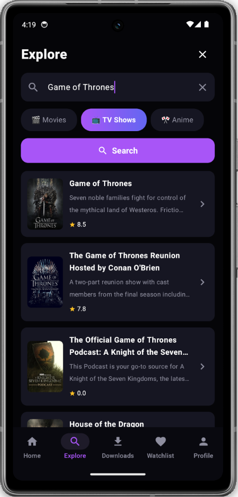 | 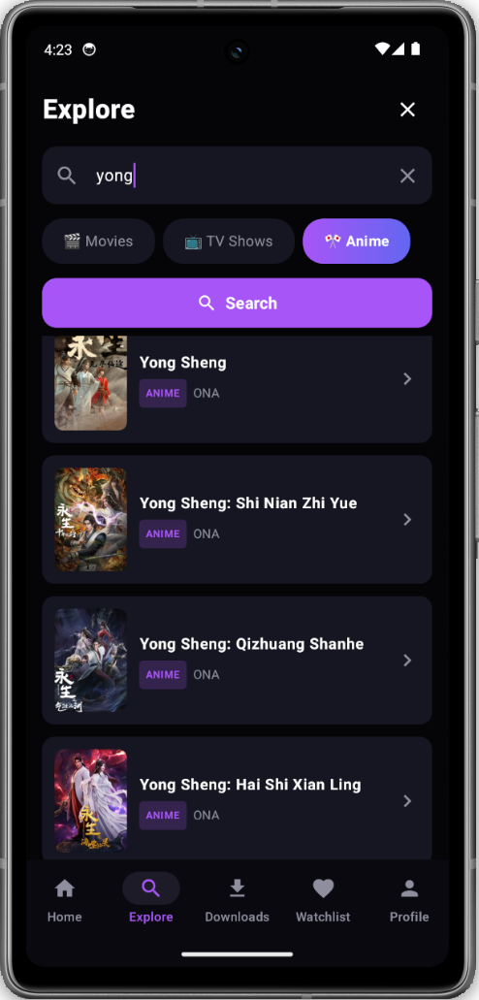 |

### 📄 Detailed Metadata
| TV Series Details | Anime Episode Grid |
|:---:|:---:|
| 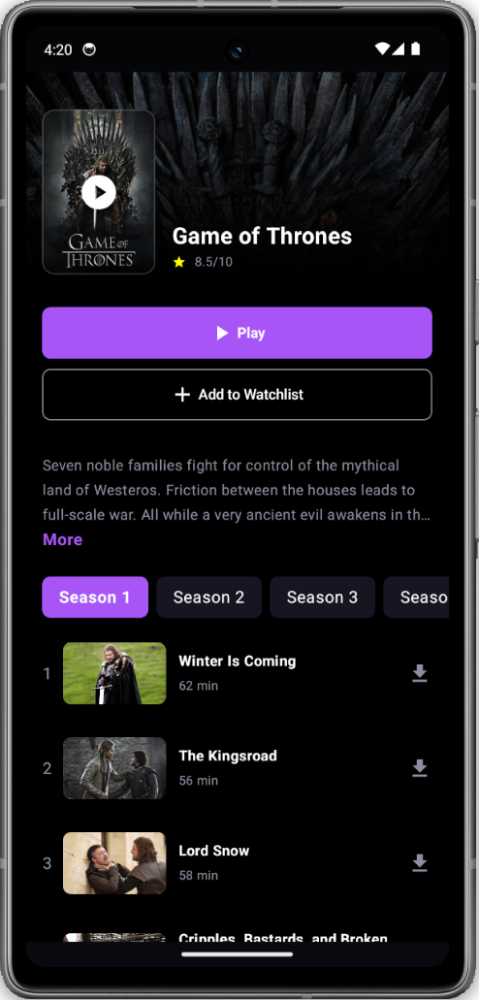 | 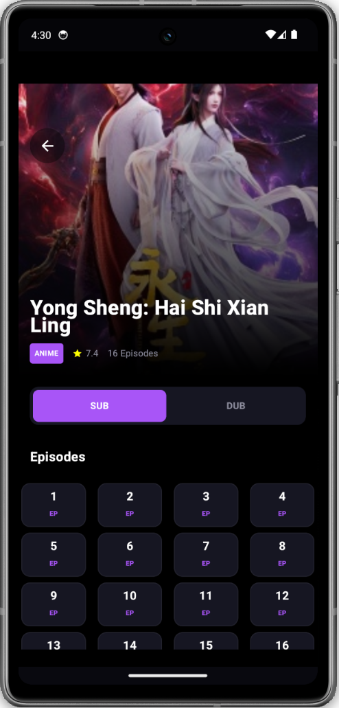 |

### 📺 Immersive Playback
| Portrait Mode | Landscape (Cinematic) | Full Screen |
|:---:|:---:|:---:|
| 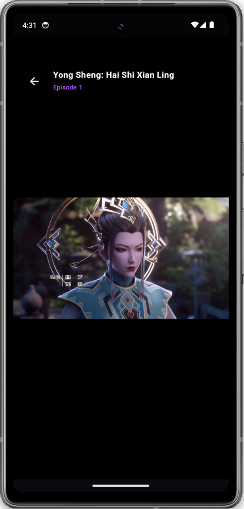 | 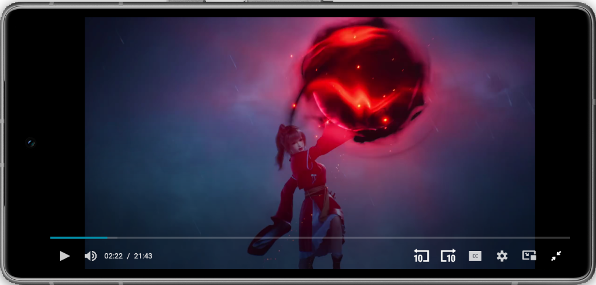 | 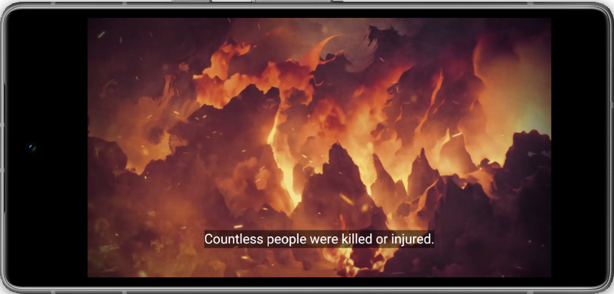 |

---

## ⚙️ TMDB API Setup Guide

To use Streamzee, you must provide your own **TMDB API Read Access Token**. Follow this step-by-step guide to get yours for free.

### Step 1: Sign Up
Search for TMDB on Google and click on the Sign Up button. Create your free account.
| 1. Google Search | 2. Click Sign Up | 3. Fill Details |
|:---:|:---:|:---:|
| 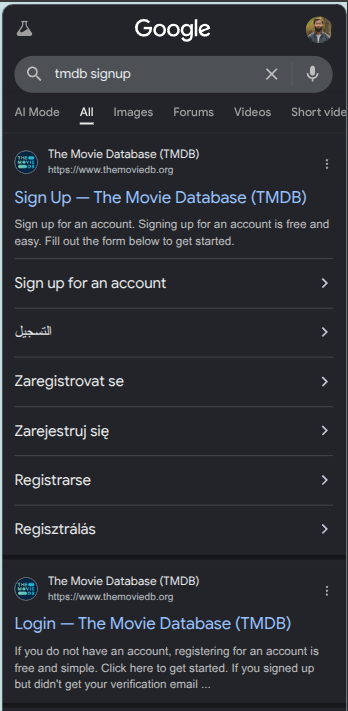 | 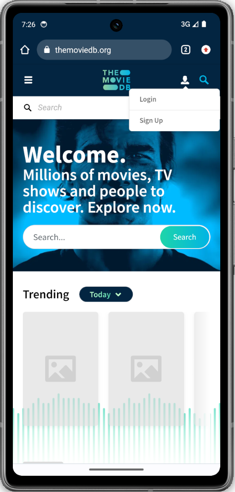 | 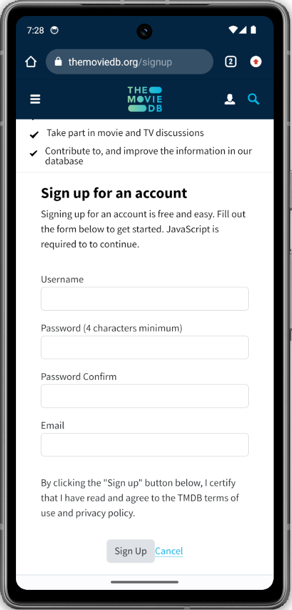 |

### Step 2: Login & Settings
Log in to your new account and navigate to your Profile Settings.
| 4. Login | 5. Go to Settings | 6. API Section |
|:---:|:---:|:---:|
| 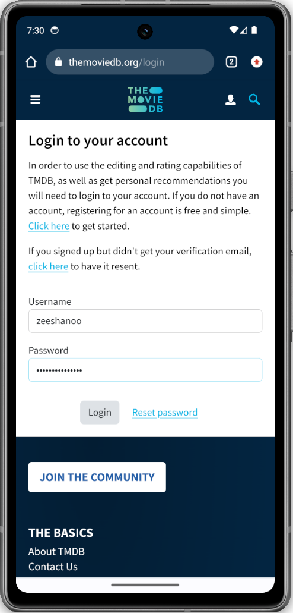 | 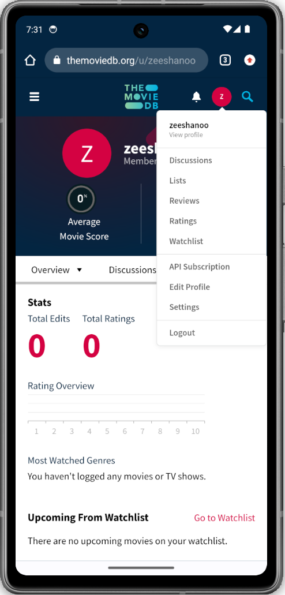 | 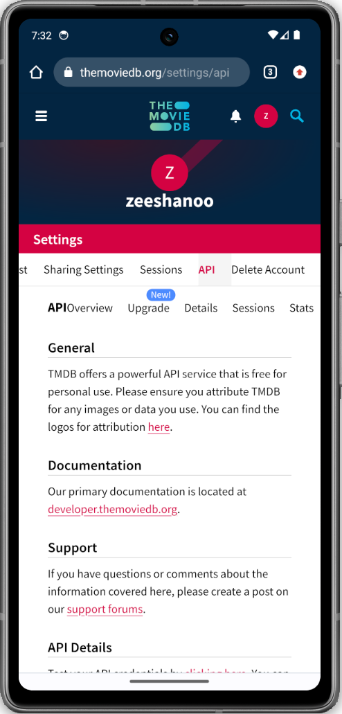 |

### Step 3: Generate Token
Request an API key (select Developer), fill in the basic app details, and copy your **Read Access Token**.
| 7. Fill API Details | 8. Copy Read Access Token | 9. Paste in Streamzee |
|:---:|:---:|:---:|
| 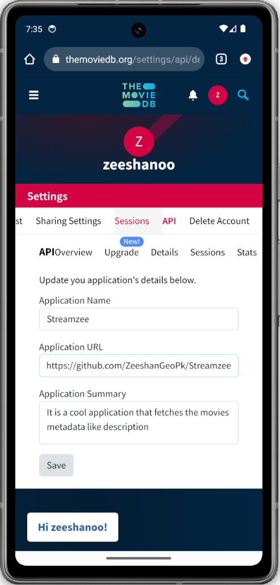 | 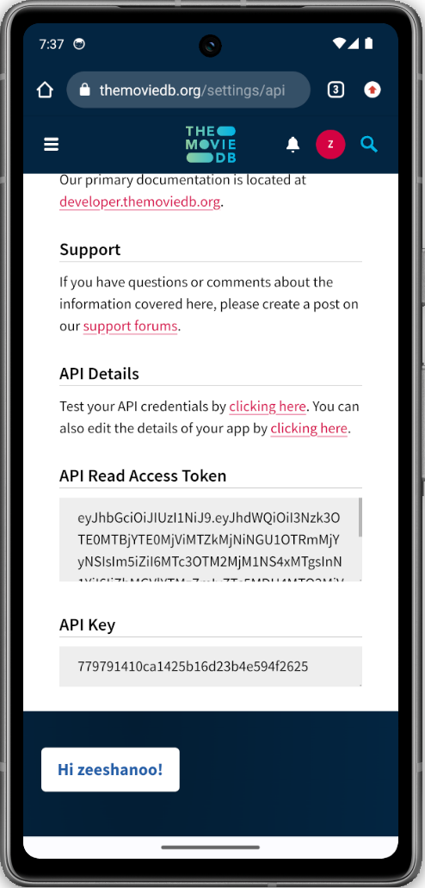 | 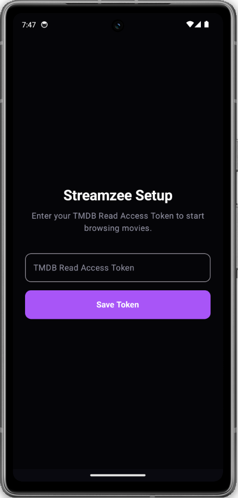 |

---

## ✨ Features

- **Triple Content Hub:** Stream Movies, TV Shows, and Anime.
- **Explore & Discover:** Explore trending, top-rated, and personalized recommendations.
- **Search:** Find any title across all categories with a powerful search engine.
- **No Ads & No Tracking:** Built with privacy in mind. No interruptions, no analytics, and no data collection.
- **Unified Watchlist:** Save any title across all categories into one organized library.
- **Modern UI:** AMOLED-ready dark theme with smooth animations and cinematic transitions.

---

## ⚙️ Initial Setup (Technical Step)

To maintain a high-quality experience without centralized servers, Streamzee requires a **TMDB API Read Access Token**. This is a one-time technical setup. I am planning to implement a user-friendly setup without needing the TMDB token in future updates, but for now, this is required to fetch metadata and streaming links.

### How to get your token:
1.  Visit [The Movie Database (TMDB)](https://www.themoviedb.org/).
2.  Create a free account and verify your email.
3.  Go to **Account Settings > API**.
4.  Generate a "Developer" API Key.
5.  Copy the **"API Read Access Token"** (the very long string).
6.  Launch Streamzee and paste the token when prompted on the Setup Screen.

---

## 🛠 Project Roadmap

| Feature | Status |
|:--- |:--- |
| **Movie/TV Streaming** | ✅ Stable |
| **Anime Streaming** | ✅ Stable |
| **Search Functionality** | ✅ Stable |
| **Watchlist Logic** | ⚠️ UnStable |
| **Bug Fixes (UI/Scaling)** | 🛠 Ongoing |
| **Downloads Section** | 🚧 Coming Soon |
| **User Profile/Stats** | 🚧 Coming Soon |

---

## ❤️ Support & Sponsorship

Streamzee is a solo-developer project. It is free to use and open-source. If you find the app useful and want to help me speed up the development of the "Downloads" feature and fix existing bugs, please consider sponsoring:

Your contributions help cover development tools and keep the project ad-free!

---

## 🛡️ Disclaimer

- **No Media Hosting:** Streamzee is a client-side application. It does not host, store, or distribute any media files (videos, movies, or episodes) on its own servers.
- **Third-Party Sources:** All streaming content is accessed via third-party embeds and publicly available metadata APIs.
- **Content Control:** We have no control over the availability, quality, or legality of the content provided by external sources.
- **User Responsibility:** Users are solely responsible for ensuring that their use of the application complies with the local laws and regulations in their jurisdiction.
- **Project Purpose:** This project is currently in Beta and is intended for personal use only.

---

**Version:** 1.0.0-beta1  
**Framework:** Jetpack Compose (Kotlin)  

---

---
