# 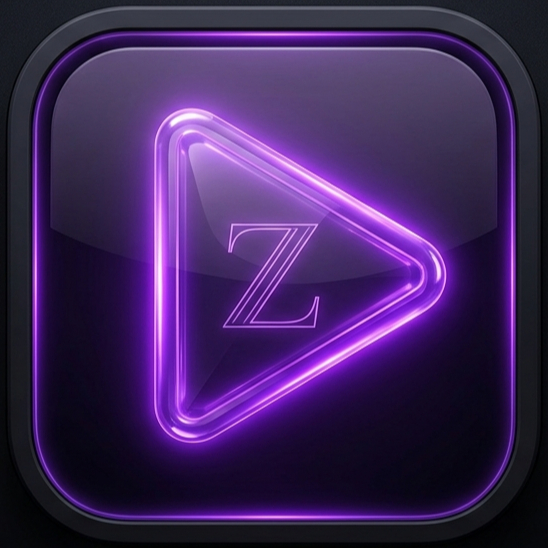 Streamzee `v1.0.0-beta1`

---
[](https://github.com/ZeeshanGeoPk/streamzee/releases)
---

**Streamzee** is a clean, cinematic, and unified streaming hub for Android. It brings together Movies, TV Series, and Anime into a single, high-performance interface built entirely with Jetpack Compose.

> **Beta Phase Notice:** This application is currently in early beta. For provider-supported streams, start playback and use the player Download button to save movies or episodes offline. The **Profile** tab includes appearance, token, cache and watch-history controls.

---

## 📱 App Demo & UI Showcase

Streamzee is designed with an AMOLED-black aesthetic and purple neon accents to provide a premium viewing experience.

### 🏠 Home & Discovery
| Home Page | Personal Watchlist |
|:---:|:---:|
| 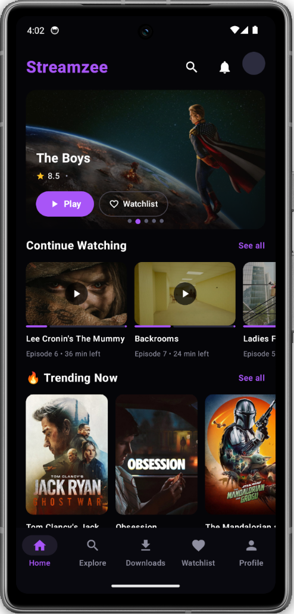 | 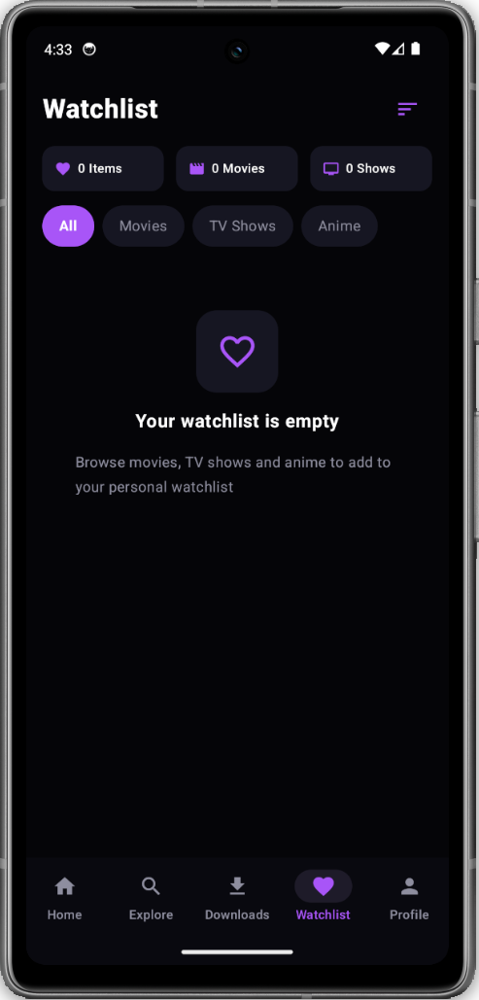 |

### 🔍 Universal Search (Categories)
| Movies | TV Shows | Anime |
|:---:|:---:|:---:|
| 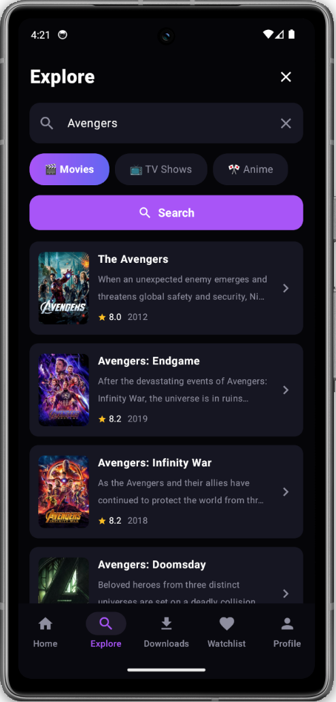 | 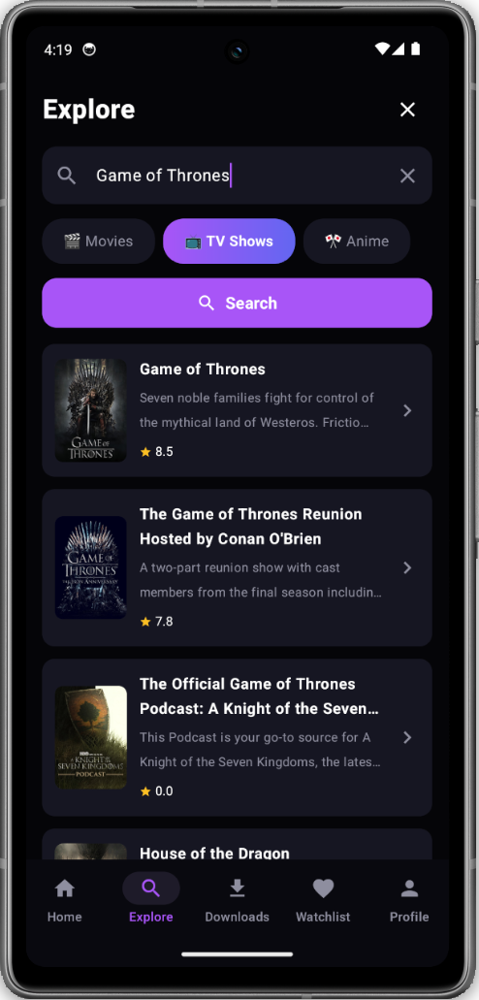 | 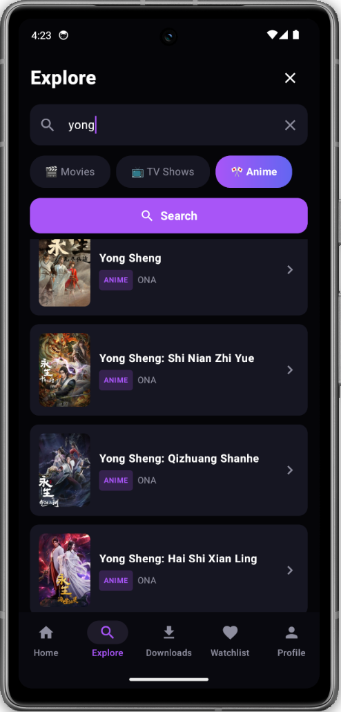 |

### 📄 Detailed Metadata
| TV Series Details | Anime Episode Grid |
|:---:|:---:|
| 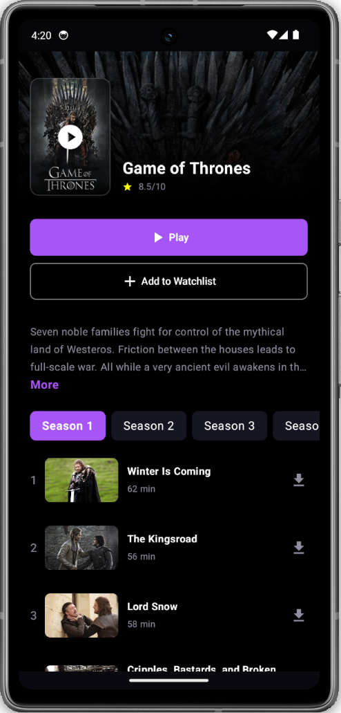 | 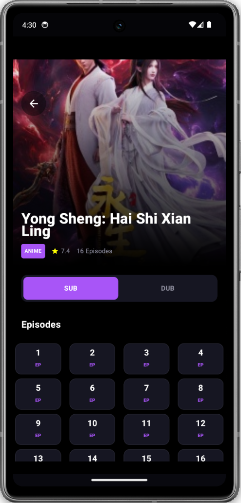 |

### 📺 Immersive Playback
| Portrait Mode | Landscape (Cinematic) | Full Screen |
|:---:|:---:|:---:|
| 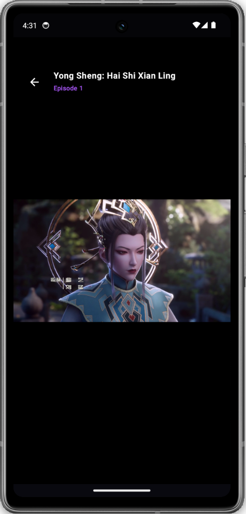 | 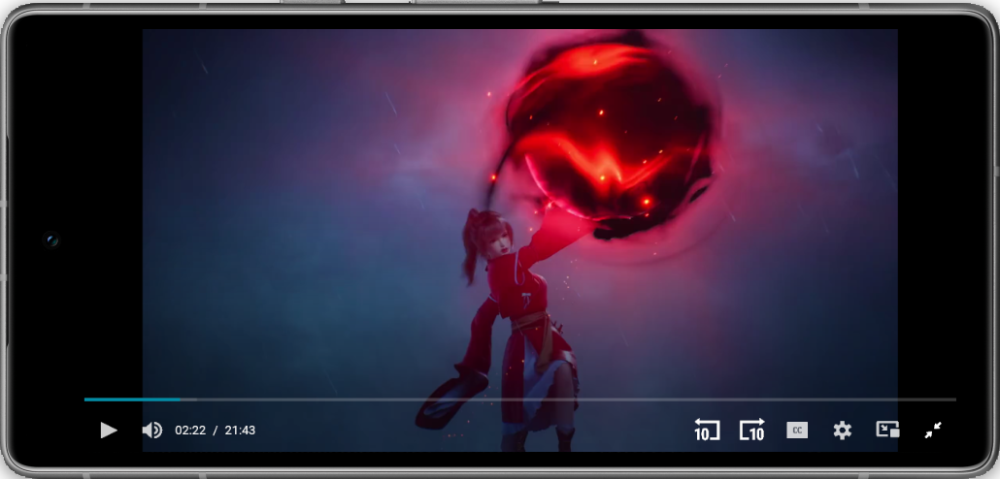 | 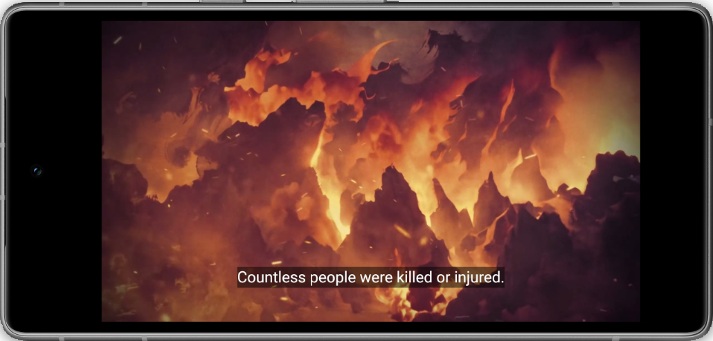 |

---

## ⚙️ TMDB API Setup Guide

To use Streamzee, you must provide your own **TMDB API Read Access Token**. Follow this step-by-step guide to get yours for free.

### Step 1: Sign Up
Search for TMDB on Google and click on the Sign Up button. Create your free account.
| 1. Google Search | 2. Click Sign Up | 3. Fill Details |
|:---:|:---:|:---:|
| 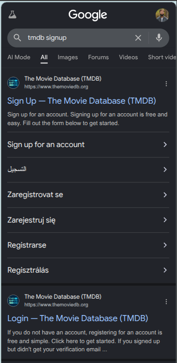 | 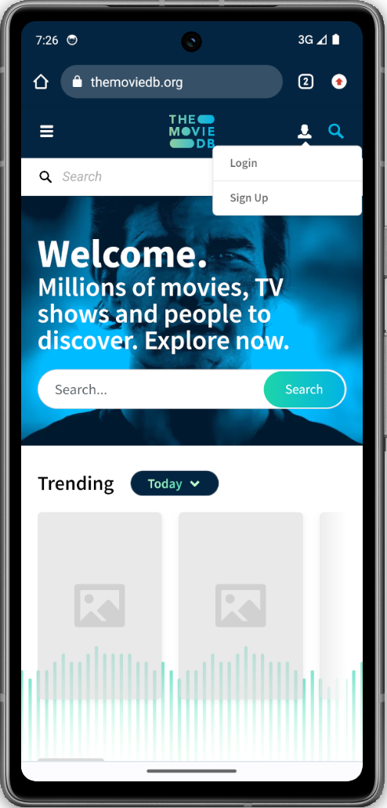 | 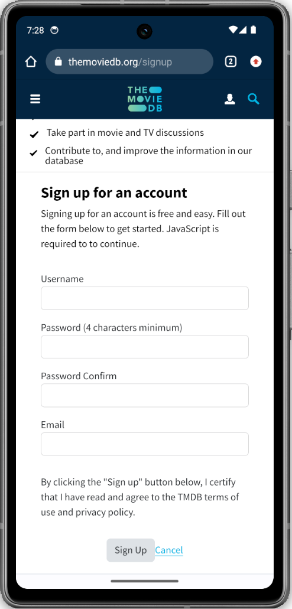 |

### Step 2: Login & Settings
Log in to your new account and navigate to your Profile Settings.
| 4. Login | 5. Go to Settings | 6. API Section |
|:---:|:---:|:---:|
| 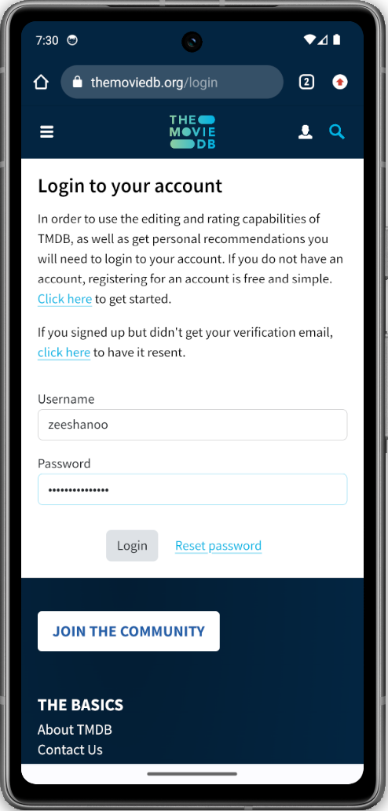 | 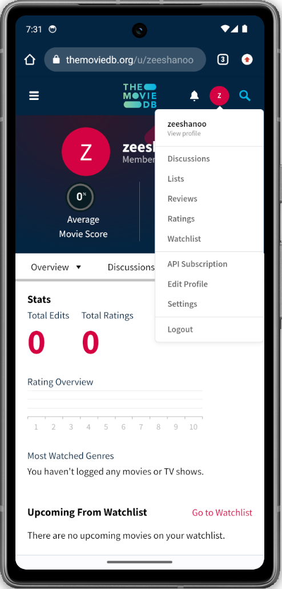 | 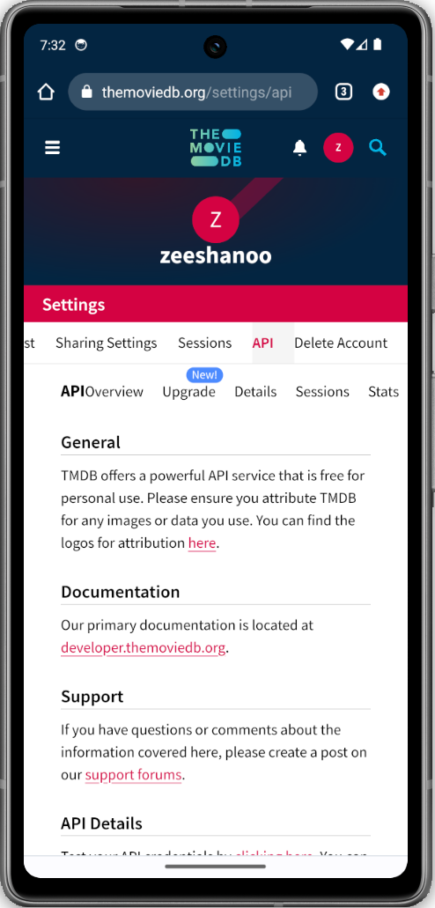 |

### Step 3: Generate Token
Request an API key (select Developer), fill in the basic app details, and copy your **Read Access Token**.
| 7. Fill API Details | 8. Copy Read Access Token | 9. Paste in Streamzee |
|:---:|:---:|:---:|
| 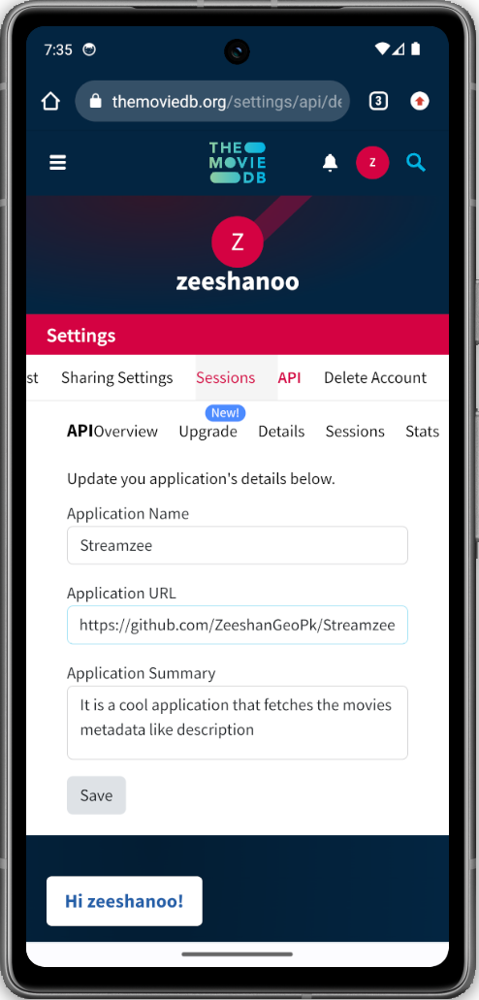 | 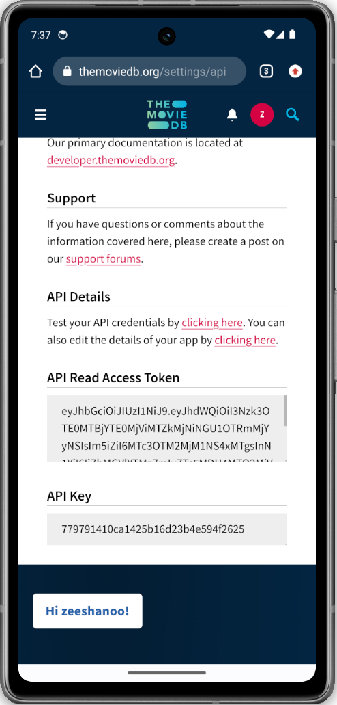 | 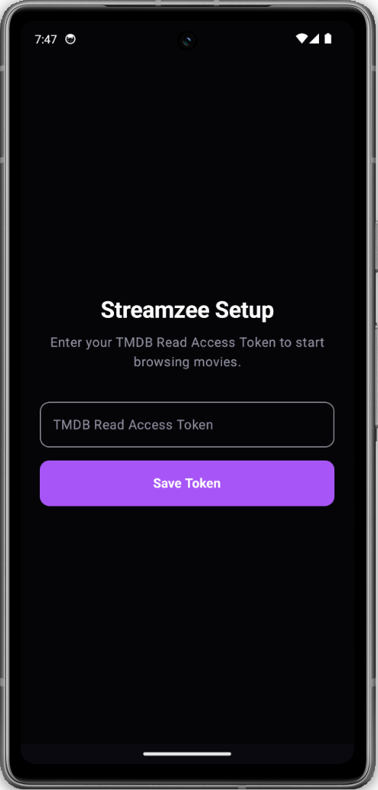 |

---

## ✨ Features

- **Triple Content Hub:** Stream Movies, TV Shows, and Anime.
- **Explore & Discover:** Explore trending, top-rated, and personalized recommendations.
- **Search:** Find any title across all categories with a powerful search engine.
- **No Ads & No Tracking:** Built with privacy in mind. No interruptions, no analytics, and no data collection.
- **Unified Watchlist:** Save any title across all categories into one organized library.
- **Modern UI:** AMOLED-ready dark theme with smooth animations and cinematic transitions.

---

## ⚙️ Initial Setup (Technical Step)

To maintain a high-quality experience without centralized servers, Streamzee requires a **TMDB API Read Access Token**. This is a one-time technical setup. I am planning to implement a user-friendly setup without needing the TMDB token in future updates, but for now, this is required to fetch metadata and streaming links.

### How to get your token:
1.  Visit [The Movie Database (TMDB)](https://www.themoviedb.org/).
2.  Create a free account and verify your email.
3.  Go to **Account Settings > API**.
4.  Generate a "Developer" API Key.
5.  Copy the **"API Read Access Token"** (the very long string).
6.  Launch Streamzee and paste the token when prompted on the Setup Screen.

---

## 🛠 Project Roadmap

| Feature | Status |
|:--- |:--- |
| **Movie/TV Streaming** | ✅ Stable |
| **Anime Streaming** | ✅ Stable |
| **Search Functionality** | ✅ Stable |
| **Watchlist Logic** | Atomic updates and resilient library refresh |
| **Bug Fixes (UI/Scaling)** | 🛠 Ongoing |
| **Downloads Section** | Available for provider-supported streams |
| **User Profile/Stats** | Settings available; viewing statistics planned |

---

## ❤️ Support & Sponsorship

Streamzee is a solo developer project that is completely free to use and open source.
If you enjoy using the app and would like to support its growth, please consider becoming a sponsor.

Your support helps me:

* Speed up development of new features like **Downloads**
* Fix bugs and improve stability
* Cover development and infrastructure costs
* Keep the project completely ad-free and privacy-friendly

### Support the Project

* [My Patreon Shop](https://www.patreon.com/cw/zeeshanoo/shop): https://www.patreon.com/cw/zeeshanoo/shop

Every contribution, no matter the size, helps keep the project moving forward. Thank you for supporting independent open-source development ❤️


---

## 🛡️ Disclaimer

- **No Media Hosting:** Streamzee is a client-side application. It does not host, store, or distribute any media files (videos, movies, or episodes) on its own servers.
- **Third-Party Sources:** All streaming content is accessed via third-party embeds and publicly available metadata APIs.
- **Content Control:** We have no control over the availability, quality, or legality of the content provided by external sources.
- **User Responsibility:** Users are solely responsible for ensuring that their use of the application complies with the local laws and regulations in their jurisdiction.
- **Project Purpose:** This project is currently in Beta and is intended for personal use only.

---

**Version:** 1.0.0-beta1  
**Framework:** Jetpack Compose (Kotlin)  

---

---

## Recent reliability improvements

- Search runs after a short typing pause and refreshes when switching categories.
- Watchlist updates are atomic; a failed metadata request no longer clears the entire library.
- Movie and TV playback progress use separate keys, including migration of existing progress.
- Profile includes a confirmed action to clear playback history while preserving the watchlist and downloads.
- TMDB tokens are checked before saving; failed validation preserves the existing token.

Validation commands (with the Android SDK configured):

```sh
./gradlew :app:testDebugUnitTest :app:lintDebug :app:assembleDebugAndroidTest
./gradlew :app:connectedDebugAndroidTest
```

The connected tests require an emulator or Android device and cover watchlist concurrency,
independent movie/TV progress, and history clearing.

## Offline playback and local files

Completed downloads can be played from the Downloads tab without network access.
The offline player remembers its position, pauses when the app goes into the background,
supports 10-second seeking and landscape fullscreen, and reports playback failures.

To access a download outside Streamzee, tap **Save to files** beside a completed download,
then select a local folder such as **Downloads** in Android's file picker. Streamzee exports
an MP4 from its offline cache. Open that folder in your Files app to play, copy, or share it.
Existing completed downloads can also be exported. The exported copy remains when you remove
the in-app download or uninstall Streamzee.

Keep the Downloads screen open during export; Cancel stops the operation and attempts to remove
the incomplete output. Export needs temporary free space in addition to the destination file.
Unsupported codecs or an incomplete cache can prevent export. It exports the selected audio/video
tracks; separate subtitle tracks are not included. App-private cache fragments remain the source
for in-app playback; saving a local file creates an independent copy.

## Music

Open **Music** from the bottom navigation, or choose **Listen to Music** on setup.
Music does not require a TMDB token or a Google login.

- Search YouTube Music songs and artists with debounced search and retry.
- Audio-only playback with background, notification and lock-screen controls.
- Persistent queue and position, favorites, shuffle, repeat, playback speed,
  15/30/60-minute sleep timers, and a mini-player across the main tabs.
- Download audio with Android's download manager; progress and failed downloads
  appear under Music > Downloads. Wi-Fi-only is enabled by default and applies
  to newly queued downloads. Remove a failed download and queue it again to retry.
- Saved downloads are preferred during playback. Streaming also uses a separate
  256 MB cache with automatic eviction; cached portions are not guaranteed to be
  complete offline songs. Use Download for dependable offline retention.
- **Save audio to files** exports a completed download to a folder you choose.
  The original audio format is preserved (not converted to MP3). In-app downloads
  are app-specific and removed on uninstall; exported copies remain.
- Clear playback cache without removing downloads or favorites.

This is an unofficial, independent integration using NewPipe Extractor v0.26.5.
Availability depends on YouTube Music's regional support and provider changes.
Account synchronization, lyrics, recommendations, and cloud playlists are not
implemented. See [third-party notices](THIRD_PARTY_NOTICES.md) for the GPL
requirements that apply to distributing builds with the extractor.

The source adapter is isolated in `music/YouTubeMusicSource.kt`. When YouTube
changes, update the pinned extractor version and run the optional live check:

```sh
STREAMZEE_LIVE_MUSIC_TEST=1 ./gradlew :app:testDebugUnitTest --rerun-tasks --tests com.streamzee.music.YouTubeMusicSourceTest
```

Ordinary unit tests skip the network check. The live check searches music,
resolves an audio URL, and requests an initial audio byte range. Device checks
should cover screen-off playback, notification controls, headphone disconnect,
airplane-mode download playback, queue restore, sleep timer, and file export.
